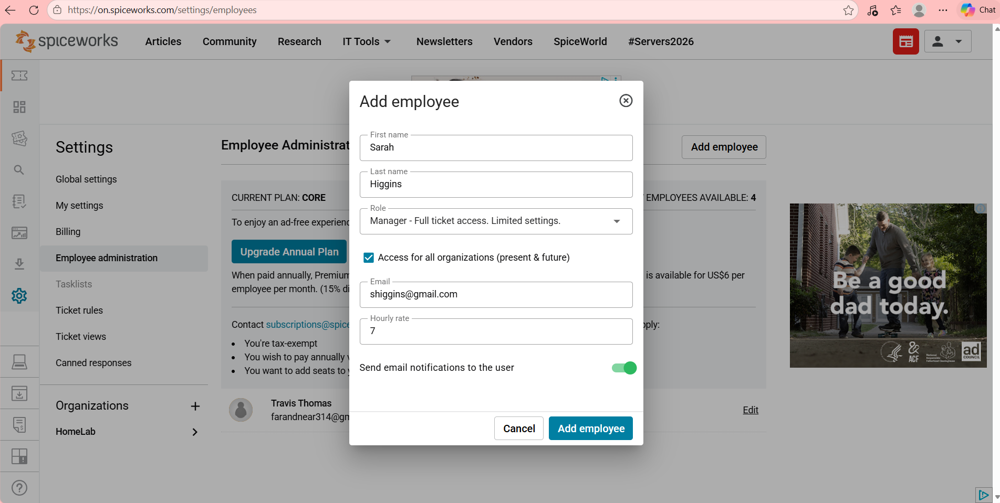
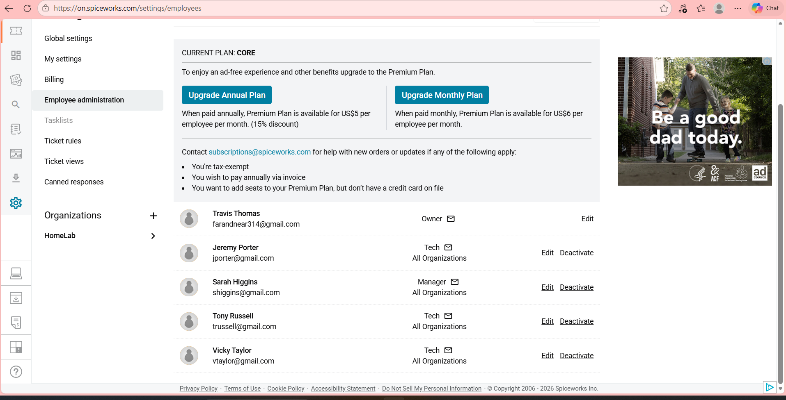
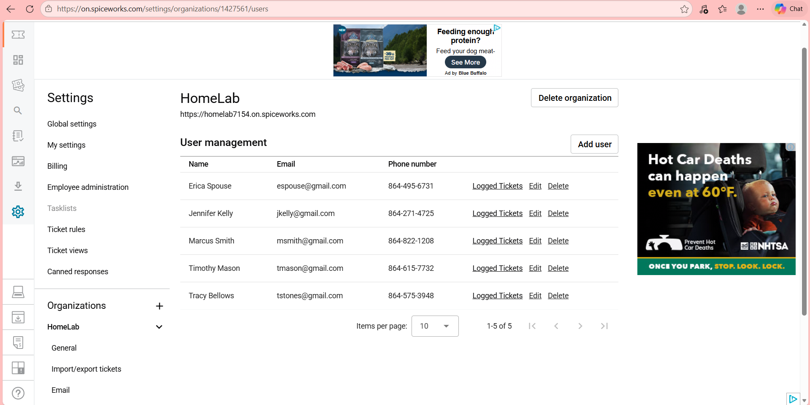
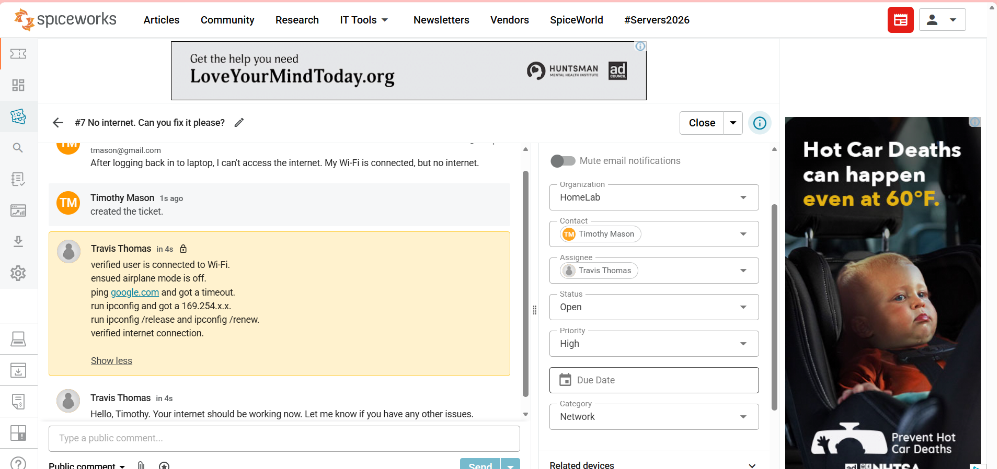
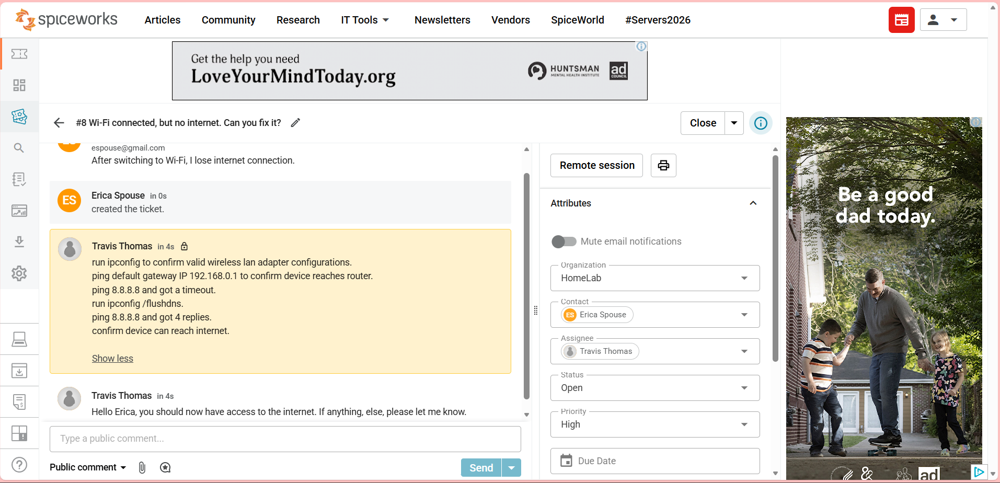
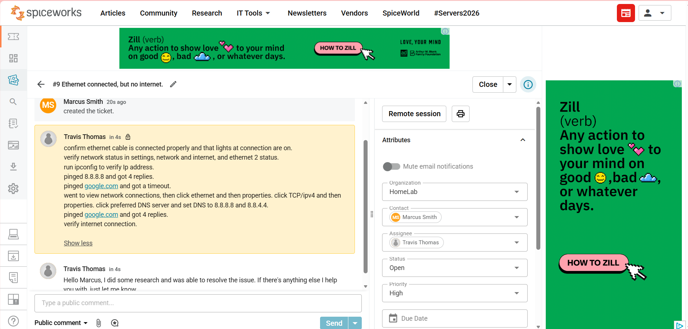

# Spiceworks-Ticketing-System

<h1>Working with Spiceworks Cloud Help desk</h1>

 

  “In this step, I added new employees to the Spiceworks Help Desk system. I entered the user’s basic information, assigned the appropriate role with ticket access permissions, enabled organization‑wide access, and configured email notifications so the employee receives updates automatically.”

 

  
  

 

  “In this step, I reviewed the list of users associated with the HomeLab organization. This page displays each user’s contact information and provides options to edit their details, view their submitted tickets, or remove them from the system. This ensures proper user management and accurate assignment of help desk tickets.”

 

  

 

  “This screenshot demonstrates the process of resolving a help desk ticket. The user reported a loss of internet connectivity despite being connected to Wi‑Fi. I verified the network status, checked for airplane mode, performed connectivity tests, and identified an APIPA address indicating a DHCP issue. After releasing and renewing the IP configuration, I confirmed successful internet access and updated the ticket with troubleshooting notes before notifying the user.”

 

  

 

  “This screenshot shows another example of resolving a connectivity‑related help desk ticket. The user reported being connected to Wi‑Fi but unable to access the internet. I validated the wireless adapter configuration, tested gateway connectivity, and identified an external connectivity issue. After flushing DNS and confirming successful replies from a public DNS server, I verified full internet access and updated the ticket with detailed troubleshooting notes before informing the user of the resolution.”

 

  

 

  “This screenshot highlights the resolution of a wired‑network connectivity issue. The user reported that their Ethernet connection showed ‘connected’ but still had no internet access. I verified the physical connection, checked the adapter status, and confirmed the device had a valid IP address. After confirming external connectivity to a public IP but not to domain names, I identified a DNS configuration issue. I updated the DNS settings to public DNS servers, retested connectivity, and confirmed full internet access before documenting the troubleshooting steps and notifying the user.”

 

  

